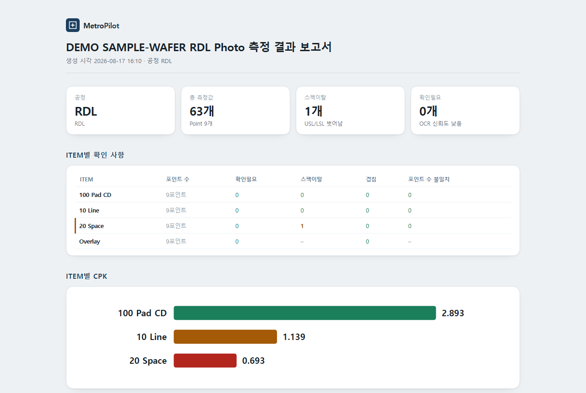
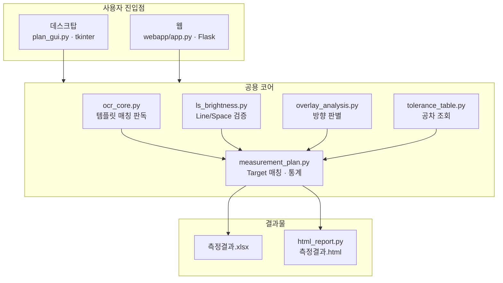

# MetroPilot — CD 측정 사진 자동 판독 시스템

**계측 장비가 사진만 남기고 데이터를 주지 않는 상황에서, 사진 폴더 하나로 측정 데이터·공정능력 통계·보고서까지 만들어내는 도구.**

Python 6,574줄 · 사진 한 장 단위로 고정한 회귀 테스트 · 데스크탑 + 웹 두 형태로 운영 중

> **바로 해보기 —** https://metropilot.duckdns.org/demo
> 로그인 없이 가짜 계측기 사진 36장으로 전 과정을 돌려볼 수 있습니다.

> **In English —** Semiconductor CD (Critical Dimension) metrology automation. The measurement tool only saves screenshots, no data files, so engineers had to read values off images by eye and retype them into Excel. This system reads those images with template matching (not general-purpose OCR), matches readings to their spec targets without relying on capture order, cross-validates every value, and produces an Excel workbook plus an HTML dashboard with Cp/Cpk/CDU statistics. Ships as both a Windows desktop app (tkinter) and a self-hosted web app (Flask + Docker + Caddy on Oracle ARM).



<sub>※ 위 화면은 **예시 데이터**로 생성한 것입니다. 실제 공정 측정값이 아닙니다.</sub>

> 📖 **[케이스 스터디 — 무엇을 결정했고 왜 그렇게 결정했나](docs/case-study.md)**
> (사이트에서 읽기: https://metropilot.duckdns.org/about)
> 막혔던 지점과 그때 고른 선택지를 실제 숫자와 함께 정리했습니다. 이 README보다 깊게 들어갑니다.

## 직접 돌려보기

실제 계측 사진은 공정 데이터라 담을 수 없어서, **가짜 계측기 사진을 만들어내는
생성기**가 들어 있습니다. 아래 두 줄이면 사진 36장을 만들고 전 과정을 검증합니다.

```bash
pip install -r webapp/requirements.txt
python scripts/regression_check.py --demo
```

처음 실행하면 사진을 만드느라 1~2분 걸립니다(난수 seed가 고정이라 누가 돌려도
같은 사진이 나옵니다). 두 번째 실행부터는 만들어둔 사진을 읽어 **기준값과 한 글자도
다르지 않은지** 대조합니다.

---

## 문제

반도체 photo 공정에서는 wafer 위 여러 Point의 선폭(CD)·정렬 오차(Overlay)를 계측 장비로 측정합니다. 그런데 이 장비는 **측정 결과를 화면에 띄우고 그 화면을 사진(.bmp)으로 저장할 뿐, 데이터 파일을 남기지 않습니다.**

그래서 실제 업무는 이렇게 돌아갔습니다.

1. 사진을 한 장씩 연다
2. 사진에 찍힌 숫자를 **눈으로 읽는다**
3. 엑셀에 **손으로 옮겨 적는다**
4. 옮겨 적은 값으로 Cp/Cpk를 계산한다

Point 하나당 사진이 6장(측정 전 3장 + 측정값 3장), wafer 하나에 Point가 10개 넘게 나오니 한 번 측정할 때마다 사진 수십~수백 장을 이 절차로 처리해야 합니다. 시간도 문제지만, **눈으로 읽고 손으로 옮기는 과정에 오타가 섞여도 아무도 모른다**는 게 더 큰 문제였습니다.

## 해결

사진이 든 폴더를 지정하면 나머지를 전부 자동으로 처리합니다.

```
사진 폴더  →  판독  →  종류 판별  →  Target 매칭  →  교차검증  →  통계  →  엑셀 + HTML 리포트
```

- **엑셀**: 측정값 원본, 매칭 검증 요약, Cpk 요약, Item별 트렌드 차트
- **HTML 리포트**: 브라우저로 바로 보는 대시보드 (위 스크린샷). 외부 라이브러리 없이 순수 SVG로 그려서 파일 하나만 있으면 어디서든 열립니다

---

## 기술적으로 어려웠던 것

이 프로젝트의 핵심은 "사진에서 숫자를 읽는 것"이 아니라, **읽은 숫자를 믿을 수 있게 만드는 것**이었습니다.

### 1. 범용 OCR을 버린 판단

처음에는 Tesseract를 썼는데 `6`을 `8`로, `5`를 `8`로 오독했습니다. 배율을 키워도 해결되지 않았습니다 — 폰트 자체를 헷갈리는 문제였습니다.

계측기 화면은 **폰트와 글자 색이 항상 고정**이라는 도메인 특성이 있습니다. 그래서 "글자를 읽는" 범용 OCR 대신, **정답이 확인된 숫자 모양(템플릿)과 한 글자씩 잘라 비교해서 가장 비슷한 것을 고르는** 템플릿 매칭으로 교체했습니다. 문제의 성질에 맞는 도구를 고른 것이 정확도 문제를 근본적으로 없앴습니다.

> `ocr_core.py`, 템플릿 생성은 `build_templates.py`

### 2. 순서에 의존하지 않는 설계

사진은 시간순으로 저장되지만, **어떤 측정이 먼저 찍힐지는 매번 다릅니다.** Overlay가 먼저일 수도 L/S가 먼저일 수도 있고, 파일명에는 종류 힌트가 전혀 없습니다.

"n번째 사진은 CD"처럼 순서를 가정하면 언젠가 반드시 깨집니다. 그래서 **순서를 아예 쓰지 않고**, 읽어낸 값이 어느 Target에 가장 가까운지로 매칭합니다.

> `measurement_plan.py`

### 3. 겹쳐 그려진 라벨

측정 종류는 "값이 몇 개인가"로 구분합니다 (4개=Overlay, 2개=Line/Space, 1개=CD). 그런데 측정값 라벨 두 줄이 화면에서 **겹쳐 그려지면** 값이 하나만 읽혀서, 2줄짜리 L/S 사진이 1줄짜리 CD 사진으로 둔갑했습니다.

읽어낸 값의 개수가 아니라 **글자 박스의 폭으로 실제 줄 수를 역산**하도록 바꿔 해결했습니다. 값을 못 읽은 줄이 있어도 "여기 줄이 두 개였다"는 사실은 살아남습니다.

### 4. Line과 Space를 가르기

Line/Space 측정은 한 사진에 값이 두 개 찍히는데, **어느 쪽이 Line이고 어느 쪽이 Space인지 사진만 봐서는 알 수 없습니다.**

- **1차 판정**: Line 값이 원칙적으로 Space보다 큼
- **2차 검증**: 크로스헤어(측정 십자선) 주변 밝기로 1차 판정이 맞는지 확인

두 판정이 엇갈리면 값을 지어내지 않고 `확인필요`로 표시합니다.

> `ls_brightness.py`

### 5. 틀렸을 때 조용히 넘어가지 않기

계측 데이터에서 가장 위험한 실패는 **틀린 값을 자신 있게 내놓는 것**입니다. 그래서 여러 겹의 안전장치를 뒀습니다.

| 장치 | 내용 |
|---|---|
| 값-좌표 정합성 | 사진에는 측정값과 XY 좌표가 같이 찍힘. `값 = √(X² + Y²)` 가 맞는지 대조해서 오독을 잡아냄 |
| 신뢰도 점수 | 템플릿 매칭 점수가 낮으면 `확인필요` 표시 |
| 애매하면 물어봄 | 두 종류의 스펙에 모두 들어맞아 확신할 수 없으면 판정하지 않고 사람에게 넘김 |
| 수동 입력 경로 | 못 읽은 값은 사람이 직접 입력. **`입력방법` 열에 자동/수동이 남아** 기계가 읽은 값과 섞이지 않음 |
| 매칭 개수 검증 | 계획한 Point 수와 실제 매칭된 개수가 다르면 경고 |

---

## 회귀 테스트

측정 도구는 **조용히 틀리는 것**이 가장 무섭습니다. 코드를 고쳤을 때 판독 결과가 달라졌는지 자동으로 대조합니다.

```bash
python scripts/regression_check.py
```

- 실측 데이터셋 **5종**에 대해, **사진 한 장 한 장의 판독 결과를 통째로** 기준값으로 고정
- 무엇이 달라졌는지 "어느 사진 어느 줄"까지 짚어줌
- 2층 구조 — ①사진별 판독(계획과 무관) ②매칭·통계(계획 반영)

처음에는 기준값이 "평균 3개와 행 수"뿐이었는데, **사진 한 장이 통째로 안 읽혀도 평균은 멀쩡해서 안 걸리는** 일이 실제로 있었습니다. 그래서 기준을 판독 단위까지 촘촘하게 내렸습니다.

---

## 구조

데스크탑과 웹이 **같은 코어를 재사용**합니다. 측정 로직은 한 곳에만 있습니다.



| 파일 | 역할 |
|---|---|
| `CD측정값_엑셀변환.py` | 전체 처리 흐름 + 엑셀 생성 (데스크탑 진입점) |
| `ocr_core.py` | 템플릿 매칭 판독, 줄 수 추정 |
| `measurement_plan.py` | Target 매칭, Cp/Cpk/CDU 통계, Item별 집계 |
| `ls_brightness.py` | 크로스헤어 밝기로 Line/Space 2차 검증 |
| `overlay_analysis.py` | Overlay 4개 값의 상/하/좌/우 판별 (화면 픽셀 위치 기준) |
| `html_report.py` | 순수 SVG HTML 리포트 (외부 의존성 0) |
| `manual_entry.py` | 못 읽은 값 수동 입력 창 |
| `webapp/` | Flask 웹 버전 (로그인, 실행 이력, 결과 다운로드) |
| `scripts/regression_check.py` | 회귀 검증 |

---

## 운영

웹 버전은 실제로 배포해서 쓰고 있습니다.

- **Oracle Cloud ARM** 인스턴스 + **Docker Compose**
- **Caddy** 리버스 프록시 — Let's Encrypt 인증서 자동 발급·갱신
- 계정 기반 접근 통제 (회원가입 없음, 관리자가 발급), 로그인 무차별 대입 방어
- 배포는 스크립트 한 줄

```bash
python scripts/deploy_to_server.py --domain <도메인>
```

## 기술 스택

**Python** · NumPy / SciPy (이미지 처리·통계) · Pillow · pandas · openpyxl · tkinter (데스크탑 GUI) · Flask (웹) · Docker · Caddy · Oracle Cloud

의존성을 일부러 얇게 유지했습니다. HTML 리포트는 차트 라이브러리 없이 SVG를 직접 그리고, OCR도 외부 엔진 없이 자체 템플릿 매칭을 씁니다 — **사내망에서 설치 승인 없이 돌아가야 하기 때문**입니다.

## 실행

```bash
# 데스크탑 — 실행하면 사진 폴더를 고르는 창이 뜹니다
pip install pillow numpy scipy pandas openpyxl
python CD측정값_엑셀변환.py

# 웹 (로컬) — Flask가 추가로 필요합니다
pip install -r webapp/requirements.txt
cd webapp && python app.py
```

결과물(`측정결과.xlsx`, `측정결과.html`, 실행 로그)은 지정한 사진 폴더 안에 생성됩니다.
